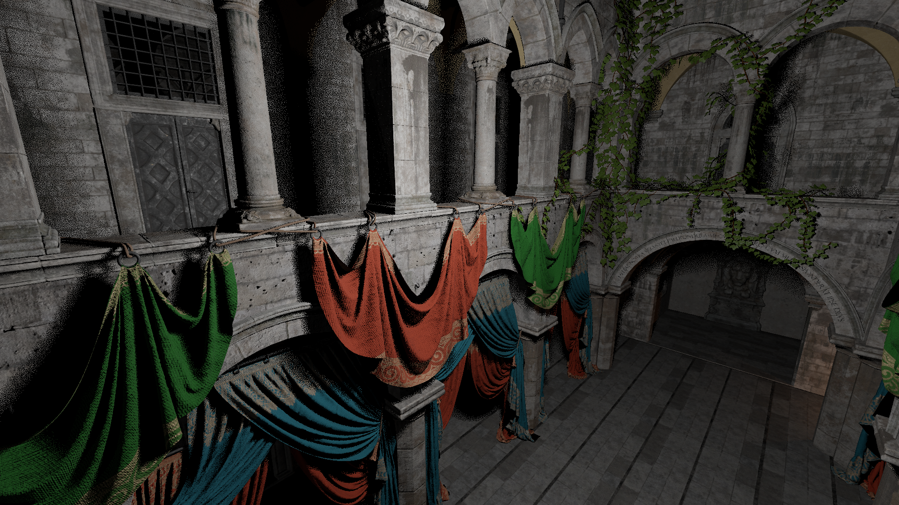

# Vulkan hardware-accelerated ray-tracing engine

## About

A personal playground for trying/testing out various ray-tracing techniques. It utilizes the Khronos hardware-accelerated ray-tracing extensions, and currently supports hard-shadows, metallic-roughness PBR, ray-cone texture LOD, alpha-masked transparency, and rough reflections.

## Models

The Sponza and DamagedHelmet glTF scenes have been taken from the [glTF sample models repository](https://github.com/KhronosGroup/glTF-Sample-Models), and were repacked with [gltfpack](https://github.com/zeux/meshoptimizer/tree/master/gltf).

## Screenshots

 

